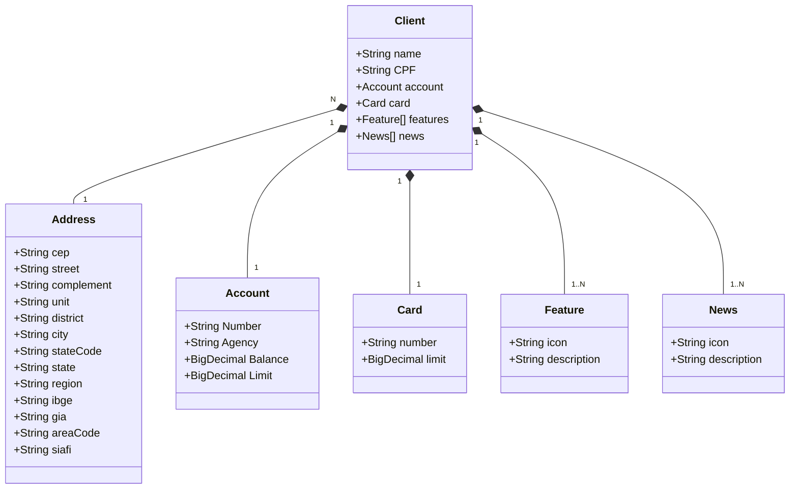
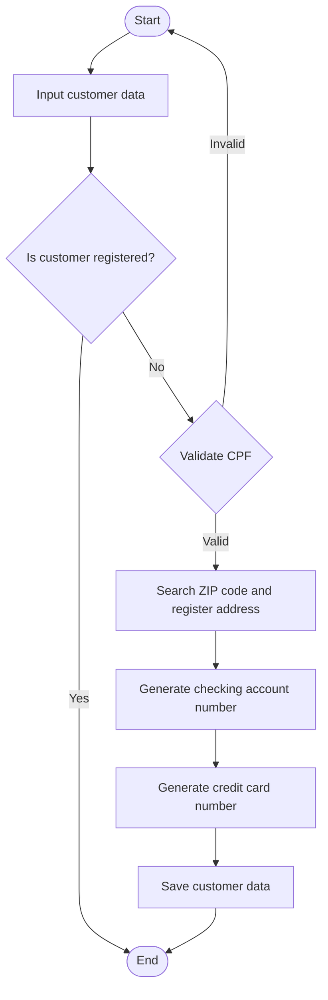
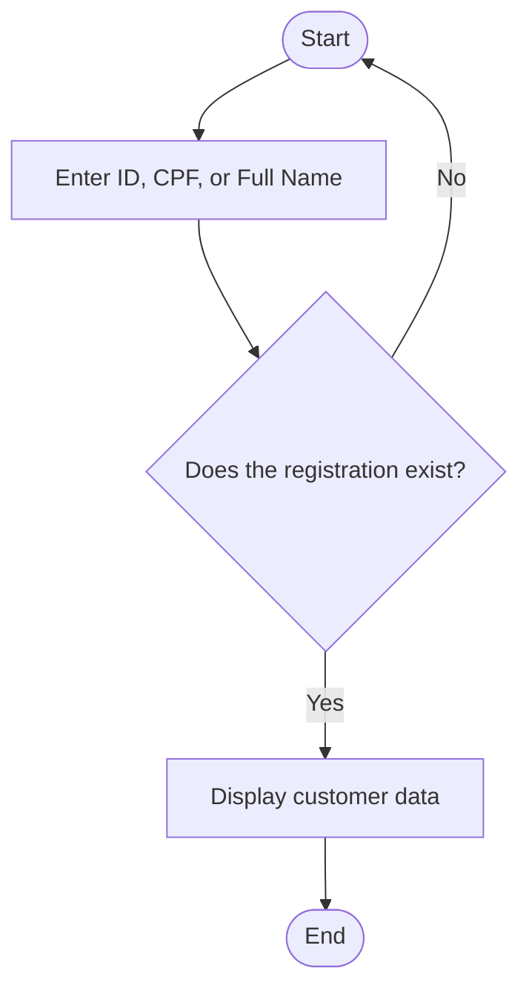
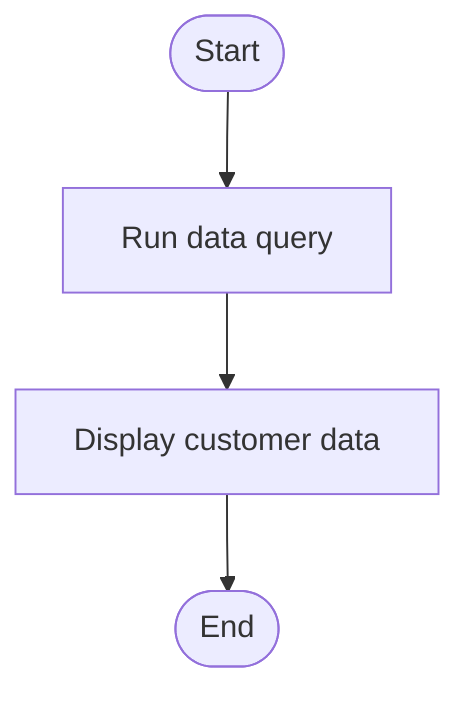
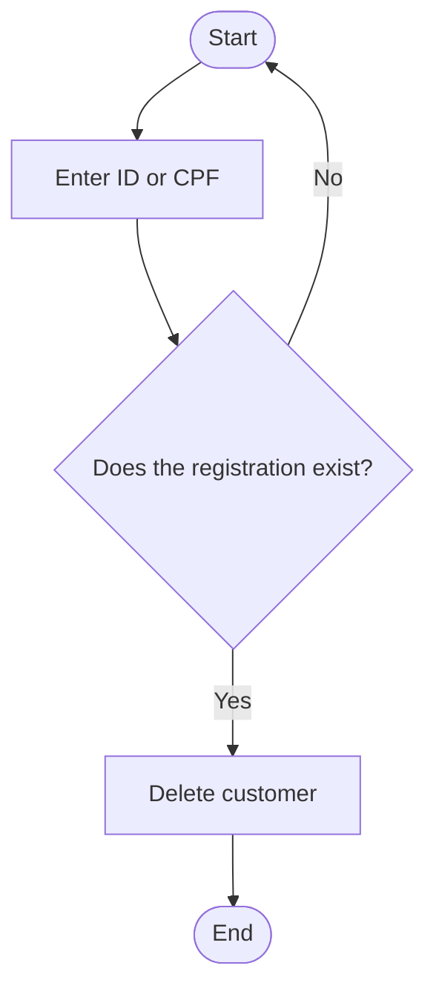
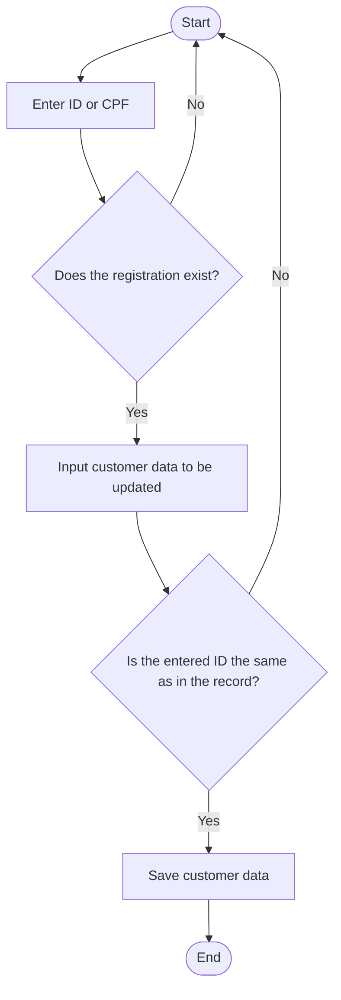

## Santander Dev Week 2025
Java RESTful API criada para a Santander Dev Week

## Diagrama de classes

## Fluxogramas
### Cadastro de clientes

### Consulta por ID, CPF e Nome completo

### Consulta todos

### Excluir cliente por ID ou CPF

### Atualizar dados por ID ou CPF

## Linguagens utilizadas
- Java Versão 21
- Spring Boot 3.5.6
- Railway
- 

## Referências

- [DIO - Trilha Java básico](https://github.com/digitalinnovationone/santander-dev-week-2023-api)

## Autores

- [@Anderson-G-Silva](https://github.com/Anderson-G-Silva)

