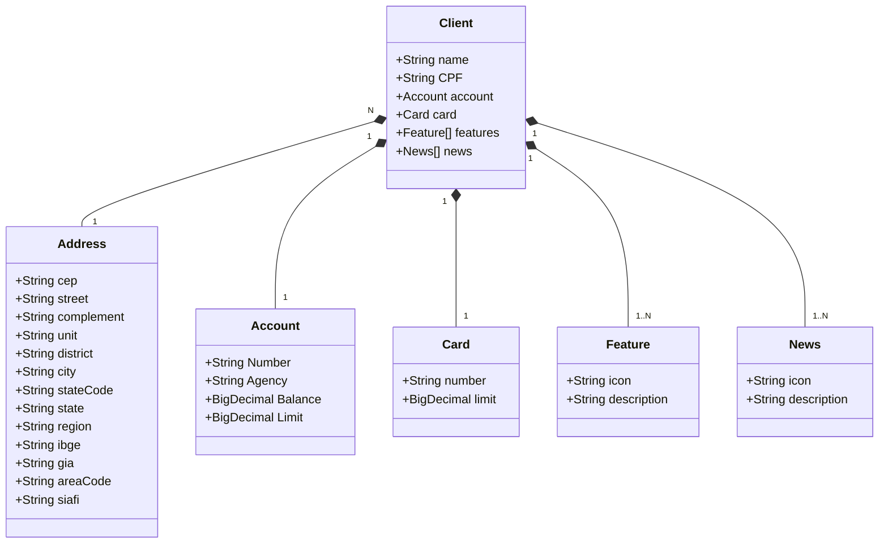

## Santander Dev Week 2025
Java RESTful API criada para a Santander Dev Week

## Diagrama de classes

```mermaid
classDiagram
    class Client {
        +String name
        +String CPF
        +Account account
        +Card card
        +Feature[] features
        +News[] news
    }

    class Address {
        +String cep
        +String street
        +String complement
        +String unit
        +String district
        +String city
        +String stateCode
        +String state
        +String region
        +String ibge
        +String gia
        +String areaCode
        +String siafi
    }

    class Account {
        +String Number
        +String Agency
        +BigDecimal Balance
        +BigDecimal Limit
    }

    class Card {
        +String number
        +BigDecimal limit
    }

    class Feature {
        +String icon
        +String description
    }

    class News {
        +String icon
        +String description
    }

    Client "N" *-- "1" Address
    Client "1" *-- "1" Account
    Client "1" *-- "1" Card
    Client "1" *-- "1..N" Feature
    Client "1" *-- "1..N" News
```
